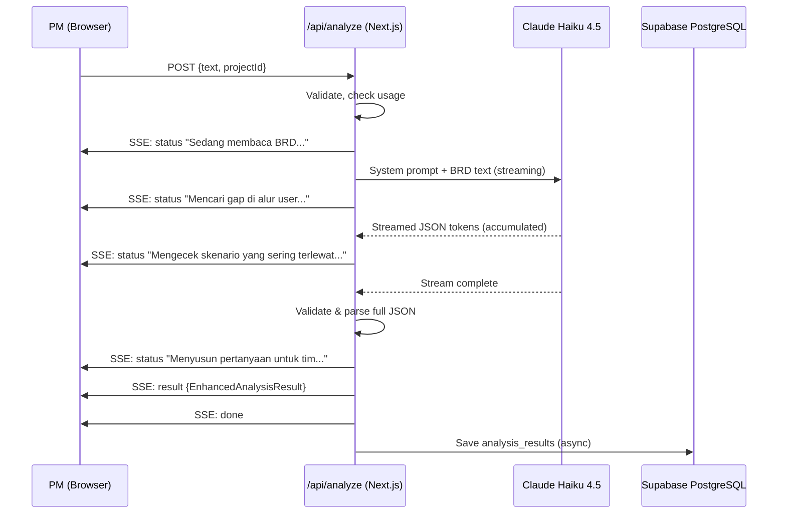

# Design Document: PRD Refinement — Enhanced Analysis Engine

## Overview

This design specifies how to evolve StoryForge's analysis engine from its current flat gap-list output to a journey-aware, actionable, PM-friendly output format. The enhancement covers six areas: prompt engineering, structured output schema, SSE streaming with status messages, frontend rendering, database schema changes, and migration strategy.

**Core principle:** The AI does the hard technical thinking; the PM sees simple, prioritized, plain-language results in Bahasa Indonesia with copy-paste-ready actions. The backend should be boring and reliable.

**Current state:** The `/api/analyze` endpoint sends the BRD to Claude Haiku 4.5, streams raw JSON text deltas via SSE, and emits a `done` event with a parsed `AnalysisResult` containing `gapList`, `clarificationQuestions`, `readinessScore`, and `readinessLabel`.

**Target state:** The same endpoint produces an enhanced response containing: a prioritized 5/5/5 summary ("Ringkasan Temuan"), Gap Cards (4-field format), a Journey Map data structure, an explainable 4-component readiness score, and source tags. The frontend shows status messages during processing, then renders structured sections after the full JSON is validated.

---

## Architecture

### High-Level Data Flow



### Key Design Decisions

1. **Anthropic Only** — All tiers use Claude Haiku 4.5. Free vs Pro differs by token budget (max gap cards, history, export, company context) — NOT by model provider. This maintains compliance (ZDR), consistency, and architecture simplicity.

2. **Accumulate-Then-Render** — No fragile progressive JSON parsing. The AI streams tokens which are accumulated server-side. Once the stream completes, the full JSON is validated and parsed. Structured sections are then emitted to the frontend in order. Perceived speed comes from human-readable status messages, not premature parsing.

3. **Single AI Call** — One prompt call, no chaining. Controls cost and latency. The prompt is disciplined: max 10 Gap Cards (MVP), one primary journey, summary derived from gap cards.

4. **Journey Map Optional** — If the AI cannot construct a coherent journey from the BRD, it returns `journeyMap: null` and the frontend gracefully hides that section. This is expected for vague or fragmented BRDs.

### Model Tier Handling

| Tier | Model | Max Gap Cards | Journey Map | Score Breakdown | Company Context |
|------|-------|---------------|-------------|-----------------|-----------------|
| Free | Claude Haiku 4.5 | 10 | Optional (may be null) | Full | ❌ |
| Pro | Claude Haiku 4.5 | 10 | Full | Full | ✅ |

Token budget difference: Free tier gets a shorter max_tokens response budget (4,096 tokens) to control API cost. Pro tier gets full budget (8,192 tokens). Both use the same model and prompt structure.

---

## End-to-End User Journey (StoryForge Product UX)

This section covers the PM's full experience using StoryForge — not just the analysis output, but every step from arrival to return visit. Each stage documents positive, negative, and edge case scenarios.

### 1. Arrives at StoryForge

| Path | Scenario | Handling |
|------|----------|----------|
| ✅ Positive | PM understands value quickly, clicks "Analisis BRD" | Clear hero copy, single CTA |
| ❌ Negative | PM unsure what to paste, hesitates | Show example BRD snippet + "Apa yang bisa kamu paste?" hint |
| ⚠️ Edge case | User has no BRD yet, only rough notes | Accept rough notes gracefully; analysis adapts (shorter output, more guidance); note: "BRD ini masih berupa catatan awal — berikut saran untuk melengkapi" |

### 2. Inputs BRD

| Path | Scenario | Handling |
|------|----------|----------|
| ✅ Positive | Pastes BRD, sees word count and guidance | Show character/word count live; soft hint at 200 words minimum |
| ❌ Negative | BRD too short (<200 words) | Accept and analyze with reduced output + note what's missing |
| ❌ Negative | BRD too long (>150k chars) | Reject with 413 + friendly message: "BRD terlalu panjang. Coba fokuskan ke satu fitur/alur." |
| ❌ Negative | Empty input | Disable analyze button; show inline hint |
| ⚠️ Edge case | Mixed language (ID + EN) | Accept; AI produces Bahasa Indonesia output regardless |
| ⚠️ Edge case | Pasted table, bullet mess, PDF formatting | Accept as-is; AI handles unstructured text; no pre-processing required |

### 3. Runs Analysis

| Path | Scenario | Handling |
|------|----------|----------|
| ✅ Positive | Status messages reassure progress; skeleton UI shows expected layout | Timer-based messages; cancel all pending messages when result arrives |
| ❌ Negative | Slow response (>20s) | Status messages continue; no timeout error until 45s |
| ❌ Negative | Network drops mid-analysis | Show "Koneksi terputus. Coba lagi?" with retry button |
| ❌ Negative | AI timeout (>45s) | If partial result parseable, show it with "Analisis mungkin tidak lengkap" notice. If not, show error + retry. |
| ⚠️ Edge case | User closes tab during analysis | No server-side impact; result not saved. On return, can re-analyze. |
| ⚠️ Edge case | User refreshes page during analysis | Same as close tab — analysis lost, can retry |
| ⚠️ Edge case | User double-clicks "Analisis" | Disable button on first click; debounce API call; prevent duplicate requests |

### 4. Reads Result

| Path | Scenario | Handling |
|------|----------|----------|
| ✅ Positive | Sees score + label, summary, journey map, gap cards in clear visual hierarchy | Render order: Score → "X saran belum tertulis di BRD" → Ringkasan → Copy actions → Journey Map → Full Gap Cards (collapsed) |
| ❌ Negative | Low score feels discouraging | Frame score constructively: show top 3 actions to improve + component breakdown explaining WHY |
| ❌ Negative | Too many findings feels overwhelming | Summary (up to 5/5/5) is first; full gap cards are collapsed by default; user expands on demand |
| ⚠️ Edge case | No journey map (BRD too vague) | Hide section; show: "BRD belum cukup detail untuk membuat peta perjalanan. Tambahkan langkah-langkah utama user agar StoryForge bisa memetakan alurnya." |
| ⚠️ Edge case | No gaps found | Show: "Tidak ada gap yang terdeteksi — BRD ini sudah cukup lengkap!" with high score |
| ⚠️ Edge case | Malformed/partial AI result | Validator attempts recovery; if partial, show what's available + notice |

### 5. Acts on Result

| Path | Scenario | Handling |
|------|----------|----------|
| ✅ Positive | Copies questions to Slack, copies requirements to PRD | "Salin Semua Pertanyaan" / "Salin Semua Requirement" buttons with toast confirmation |
| ❌ Negative | Copy fails (clipboard API blocked) | Fallback: select-all text in a modal/textarea user can manually copy |
| ❌ Negative | Copied text too long for Slack message | Questions are formatted as numbered list — manageable length. If >15 items in full list, show "Salin 5 teratas" option |
| ⚠️ Edge case | User wants only engineering questions, not all | Gap Cards are grouped/filterable by category in the expanded view |
| ⚠️ Edge case | Stakeholder asks "where did this come from?" | Source tags ("Sudah tertulis di BRD" / "Belum tertulis di BRD") provide attribution |

### 6. Saves / Returns Later

| Path | Scenario | Handling |
|------|----------|----------|
| ✅ Positive | Result saved to history; user returns and sees past analyses | Auto-save on analysis complete for authenticated users |
| ❌ Negative | Guest user (not logged in) expects history | After analysis, show: "Daftar untuk menyimpan hasil analisis" — non-blocking, appears after result |
| ❌ Negative | Usage limit reached | Show limit clearly BEFORE analysis: "Sisa 1 analisis bulan ini" in header. After limit, show upgrade CTA without blocking access to past results. |
| ⚠️ Edge case | Supabase save fails | Retry once async; if still fails, show result to user normally (don't block UX for DB issues); log error |
| ⚠️ Edge case | Old v1 result loaded from history | Version router renders with legacy OutputPanel; no broken UI |

### 7. Upgrades / Continues

| Path | Scenario | Handling |
|------|----------|----------|
| ✅ Positive | Sees value, upgrades for more analyses + company context + history | Upgrade CTA appears naturally at usage limit, not as aggressive popup |
| ❌ Negative | Paywall appears too early (before user sees value) | NEVER block the first 3 analyses. Paywall only triggers after free quota is spent. |
| ⚠️ Edge case | Pro user's company context not set up | Prompt to set up context after first analysis: "Tambahkan konteks perusahaan untuk hasil yang lebih akurat" |
| ⚠️ Edge case | Manual bank transfer pending verification | Show "Menunggu verifikasi pembayaran (< 24 jam)" status; allow continued access during grace period |

---

## Components and Interfaces

### 1. Enhanced System Prompt (`lib/prompts/analyze-v2.ts`)

A new module exporting the v2 system prompt. Separate from current `SYSTEM_PROMPT` constant to enable incremental rollout.

```typescript
// lib/prompts/analyze-v2.ts
export function buildAnalyzeV2Prompt(projectContext?: ProjectContextInput): string
```

**Prompt structure:**
- Role definition (BRD analyst for PMs, output in Bahasa Indonesia)
- Output JSON schema definition (see Data Models)
- Journey extraction rules (extract steps, check failure/timeout/cancellation/back paths at each)
- Technical blindspot detection rules (6 categories, phrased as user scenarios — never use technical labels)
- Gap Card formatting rules (4 fields: Yang belum jelas, Kenapa penting, Pertanyaan untuk tim, Usulan requirement)
- Scoring rubric (4 components with weights: 30/25/25/20)
- Source tagging rules ("Sudah tertulis di BRD" vs "Belum tertulis di BRD")
- MVP constraints: max 10 gap cards, one primary journey flow, summary derived from cards
- Fallback instruction: if BRD is too vague for journey map, return `journeyMap: null`

### 2. Response Validator (`lib/analysis-validator.ts`)

A post-processing module that validates and enforces constraints on the AI output. Does NOT attempt to parse partial JSON mid-stream.

```typescript
// lib/analysis-validator.ts
export function validateAndNormalize(
  raw: unknown,
  brdText: string
): { result: EnhancedAnalysisResult; warnings: string[] }
```

**Server-side enforcement (do not rely on AI compliance):**
- Truncate `ringkasanTemuan` arrays to max 5 items each
- Truncate `gapCards` to max 10 items
- Validate `brdReference` is actually a substring of BRD text (set to null if not)
- Verify score computation matches component weights (recompute if mismatch)
- Ensure all required fields are present (fallback to defaults if missing)
- Enforce score label correctness (recompute from score value)
- Strip any technical jargon terms from category fields
- Cancel pending status messages on result emission

### 3. Updated API Route (`app/api/analyze/route.ts`)

The existing route is modified to:
- Use the v2 prompt (behind a feature flag `ANALYSIS_V2_ENABLED`)
- Stream status messages to the frontend during AI processing
- Accumulate full AI response tokens
- On stream complete: validate JSON → emit structured `result` event → emit `done`
- Maintain backward-compatible fields in the result
- On JSON validation failure: attempt recovery (retry once), then emit `error`

**SSE Status Messages (streamed during AI processing):**
```
status: "Sedang membaca BRD..."                        (immediately on request)
status: "Memetakan alur utama user..."                 (after ~3 seconds)
status: "Mengecek skenario yang sering terlewat..."    (after ~8 seconds)
status: "Menyusun pertanyaan untuk tim..."             (after ~15 seconds)
status: "Membuat usulan requirement..."                (after ~20 seconds)
```

These are timer-based (not dependent on actual AI progress) to keep the UI feeling alive. All pending status messages are cancelled immediately when the result arrives — no late messages flashing after results are shown.

### 4. Frontend Components

| Component | Purpose |
|-----------|---------|
| `components/analyze/AnalysisProgress.tsx` | Shows skeleton UI + rotating status messages during loading |
| `components/analyze/RingkasanTemuan.tsx` | Renders the 5/5/5 prioritized summary with copy actions |
| `components/analyze/GapCard.tsx` | Renders a single Gap Card (4 fields) replacing current `GapItem` |
| `components/analyze/JourneyMap.tsx` | Renders the journey flowchart using nodes/edges data |
| `components/analyze/ScoreBreakdown.tsx` | Renders the 4-component score with explanations |
| `components/analyze/CopyActions.tsx` | "Salin Semua Pertanyaan" / "Salin Semua Usulan" buttons |
| `components/analyze/OutputPanelV2.tsx` | New orchestrator panel composing all above components |

### 5. Analysis Progress UI

During the AI processing phase (before results arrive), the frontend shows:
- Skeleton placeholders for score, summary, and gap cards
- A rotating status message (matching the SSE status events)
- A subtle loading animation

This creates perceived speed without fragile progressive parsing.

### 6. Journey Map Renderer

The Journey Map is rendered client-side as a simple vertical flowchart. No heavy graph library — uses CSS flexbox/grid with SVG arrows for connections.

```typescript
// components/analyze/JourneyMap.tsx
interface JourneyMapProps {
  nodes: JourneyNode[]
  edges: JourneyEdge[]
  multiFlowNote?: string  // "Kami mendeteksi N alur..."
}
```

**Visual states:**
- Solid border + blue background: "Ada di BRD" (explicit in document)
- Dashed border + gray background: "Disimpulkan AI" (inferred)
- Red border + red tint: "Belum ada" (missing — gap)

Arrows between nodes are colored by path type:
- Green: happy path
- Orange: error/failure path
- Red dashed: missing path (gap)

---

## Data Models

### Enhanced Analysis Result (Output JSON Schema)

```typescript
// types/analysis-v2.ts

export interface EnhancedAnalysisResult {
  // === Backward-compatible fields (legacy) ===
  gapList: GapItem[]                    // Preserved for migration
  clarificationQuestions: string[]       // Preserved for migration
  readinessScore: number                 // 0-100
  readinessLabel: string                 // "Siap" | "Perlu Klarifikasi" | "Tidak Siap"

  // === New fields (v2) ===
  scoreComponents: ScoreComponents
  ringkasanTemuan: RingkasanTemuan
  gapCards: GapCard[]
  journeyMap: JourneyMap | null          // null = AI couldn't produce one
  version: 2                             // Schema version marker
}

export interface ScoreComponents {
  kelengkapanAlur: ComponentScore       // 30% weight
  kesiapanSprint: ComponentScore        // 25% weight
  kejelasanRequirement: ComponentScore   // 25% weight
  konteksBisnis: ComponentScore          // 20% weight
  topActions: string[]                   // Top 3 improvements (if score < 80)
}

export interface ComponentScore {
  score: number           // 0-100
  explanation: string     // One-sentence explanation in Bahasa Indonesia
}

export interface RingkasanTemuan {
  criticalGaps: SummaryItem[]       // Up to 5
  questionsToAsk: SummaryItem[]     // Up to 5
  requirementsToAdd: SummaryItem[]  // Up to 5
  totalNewFindings: number          // Count of "Ditambahkan oleh StoryForge" items
}

export interface SummaryItem {
  text: string
  severity: 'high' | 'medium' | 'low'
  source: 'brd' | 'storyforge'     // "Sudah tertulis di BRD" or "Belum tertulis di BRD"
}

export interface GapCard {
  id: string                        // Stable ID for React keys
  yangBelumJelas: string            // What is missing (1-2 sentences, plain language)
  kenapaPenting: string             // Why it matters (business impact)
  pertanyaanUntukTim: string        // Ready-to-send question (copy-paste to Slack)
  usulanRequirement: string         // Suggested requirement sentence
  category: string                  // Gap category (never contains technical jargon)
  severity: 'high' | 'medium' | 'low'
  source: 'brd' | 'storyforge'     // "Sudah tertulis di BRD" or "Belum tertulis di BRD"
  brdReference: string | null       // Quoted text from BRD if applicable
}

export interface JourneyMap {
  title: string                     // Flow name
  nodes: JourneyNode[]
  edges: JourneyEdge[]
  multiFlowNote: string | null      // "Kami mendeteksi N alur..."
}

export interface JourneyNode {
  id: string
  label: string                     // Step description in Bahasa Indonesia
  status: 'explicit' | 'inferred' | 'missing'
  // explicit = "Ada di BRD", inferred = "Disimpulkan AI", missing = "Belum ada"
}

export interface JourneyEdge {
  from: string                      // Node ID
  to: string                        // Node ID
  pathType: 'happy' | 'error' | 'missing'
  label?: string                    // Optional edge label
}
```

### Database Schema Changes

```sql
-- Migration: enhance_analysis_results_v2

-- Add v2 columns to analysis_results
ALTER TABLE analysis_results
  ADD COLUMN IF NOT EXISTS score_components JSONB,
  ADD COLUMN IF NOT EXISTS ringkasan_temuan JSONB,
  ADD COLUMN IF NOT EXISTS gap_cards JSONB,
  ADD COLUMN IF NOT EXISTS journey_map JSONB,
  ADD COLUMN IF NOT EXISTS schema_version INTEGER DEFAULT 1;

-- Index for filtering by schema version during migration
CREATE INDEX IF NOT EXISTS idx_results_schema_version
  ON analysis_results(schema_version)
  WHERE schema_version IS NOT NULL;

-- Comment for documentation
COMMENT ON COLUMN analysis_results.schema_version IS 
  '1 = legacy format (gapList only), 2 = enhanced format (gap cards + journey + score components)';
```

### SSE Event Types

| Event Name | Payload | When Emitted |
|-----------|---------|--------------|
| `status` | `{ phase: string, message: string }` | Timer-based during AI processing |
| `result` | `EnhancedAnalysisResult` | After full JSON validated |
| `done` | `{}` | After result, signals stream end |
| `error` | `{ error: string, partial?: EnhancedAnalysisResult }` | On failure |

Simplified from the previous design: no per-section events (`score`, `summary`, `gapCard`). The frontend receives the full validated result in one `result` event and renders all sections simultaneously. The skeleton UI + status messages handle perceived latency.

---

## Correctness Properties

*A property is a characteristic or behavior that should hold true across all valid executions of a system — essentially, a formal statement about what the system should do. Properties serve as the bridge between human-readable specifications and machine-verifiable correctness guarantees.*

### Property 1: Summary Size Constraint

*For any* `EnhancedAnalysisResult`, the `ringkasanTemuan` SHALL contain at most 5 items in `criticalGaps`, at most 5 in `questionsToAsk`, and at most 5 in `requirementsToAdd` — and the count in each category SHALL equal the minimum of 5 and the number of available items of that type (no padding).

**Validates: Requirements 1.1, 1.5**

### Property 2: Summary Prioritization by Severity

*For any* list of gap cards with mixed severities, the summary selection function SHALL choose items such that no excluded item has higher severity than any included item. Formally: for every item in the summary and every item NOT in the summary (of the same category), `included.severity >= excluded.severity` in the ordering high > medium > low.

**Validates: Requirements 1.2**

### Property 3: Gap Card Structural Completeness

*For any* `GapCard` in the output, all four content fields (`yangBelumJelas`, `kenapaPenting`, `pertanyaanUntukTim`, `usulanRequirement`) SHALL be non-empty strings, `source` SHALL be one of `'brd'` or `'storyforge'`, `severity` SHALL be one of `'high'`, `'medium'`, or `'low'`, and `category` SHALL NOT contain the words "blindspot", "teknis", or "technical".

**Validates: Requirements 3.1, 5.2, 5.3, 8.3**

### Property 4: BRD Reference Validity

*For any* `GapCard` where `brdReference` is not null, the `brdReference` string SHALL be a substring of the original BRD input text.

**Validates: Requirements 3.4**

### Property 5: Journey Map Structural Integrity

*For any* non-null `JourneyMap`, every edge's `from` and `to` SHALL reference existing node IDs, every edge's `pathType` SHALL be one of `'happy'`, `'error'`, or `'missing'`, and every node's `status` SHALL be one of `'explicit'`, `'inferred'`, or `'missing'`.

**Validates: Requirements 6.1, 6.2**

### Property 6: Score Computation Correctness

*For any* `EnhancedAnalysisResult`, the `readinessScore` SHALL equal `round(0.30 * kelengkapanAlur.score + 0.25 * kesiapanSprint.score + 0.25 * kejelasanRequirement.score + 0.20 * konteksBisnis.score)` (within ±1 for rounding), and each component's `explanation` SHALL be a non-empty string.

**Validates: Requirements 7.1, 7.2**

### Property 7: Score Label Correctness

*For any* `readinessScore` in range 0-100, the `readinessLabel` SHALL be "Siap" if score >= 80, "Perlu Klarifikasi" if score >= 50 and < 80, and "Tidak Siap" if score < 50.

**Validates: Requirements 7.4**

### Property 8: Top Actions Conditional Presence

*For any* `EnhancedAnalysisResult` where `readinessScore < 80`, the `scoreComponents.topActions` SHALL contain between 1 and 3 non-empty strings. When `readinessScore >= 80`, `topActions` MAY be empty.

**Validates: Requirements 7.3**

### Property 9: Total New Findings Count Accuracy

*For any* `RingkasanTemuan`, the `totalNewFindings` SHALL equal the count of items across all three categories (`criticalGaps`, `questionsToAsk`, `requirementsToAdd`) where `source === 'storyforge'`.

**Validates: Requirements 8.4**

### Property 10: Copy Formatter Correctness

*For any* non-empty array of `GapCard` objects, the "copy all questions" formatter SHALL produce a numbered list containing exactly one line per card matching its `pertanyaanUntukTim` field, and the "copy all requirements" formatter SHALL produce a bullet list containing exactly one line per card matching its `usulanRequirement` field.

**Validates: Requirements 9.3, 9.4**

### Property 11: Gap Card Count Limit

*For any* `EnhancedAnalysisResult`, the `gapCards` array SHALL contain at most 10 items.

**Validates: MVP scope constraint**

### Property 12: Backward Compatibility

*For any* `EnhancedAnalysisResult`, the object SHALL also satisfy the legacy `AnalysisResult` interface — specifically, it SHALL contain non-null `gapList` (array), `clarificationQuestions` (array), `readinessScore` (number), and `readinessLabel` (string).

**Validates: Requirements 10.4**

### Property 13: Copy Output Plain Text Format

*For any* output from the summary copy formatter or individual Gap Card copy, the resulting string SHALL contain no HTML tags, no Markdown formatting characters (**, __, `, #), and no JSON syntax — only plain text suitable for pasting into chat applications.

**Validates: Requirements 1.4, 9.1**

---

## Error Handling

### AI Response Errors

| Scenario | Handling |
|----------|----------|
| AI returns malformed JSON | Retry once with same prompt. If still malformed, emit `error` SSE event with "Terjadi kesalahan saat memproses. Coba lagi." |
| AI returns empty response | Emit `error` event; log for monitoring |
| AI times out (>30s) | If partial JSON accumulated, attempt to parse. If parseable, emit result with `partial: true`. If not, emit `error`. |
| AI omits Journey Map | `journeyMap: null` — frontend shows fallback message: "BRD belum cukup detail untuk peta perjalanan." |
| AI produces > 5 items in summary | Validator truncates to 5 (enforced server-side) |
| AI produces > 10 gap cards | Validator truncates to 10 (enforced server-side) |
| API key missing/invalid | Emit `error` event; do not expose key details |
| Network error to AI provider | Retry once with exponential backoff; if still failing, emit `error` |
| Score doesn't match component weights | Validator recomputes correct score |

### Frontend Graceful Degradation

| Scenario | Handling |
|----------|----------|
| `journeyMap` is null | Hide Journey Map section; show informational note |
| `scoreComponents` missing (legacy result) | Show simple score badge without breakdown |
| `gapCards` empty | Show "Tidak ada gap yang terdeteksi — BRD ini sudah cukup lengkap!" message |
| SSE connection drops | Show partial results if available with "Analisis mungkin tidak lengkap" notice |
| Schema version = 1 (old result loaded from history) | Render with legacy OutputPanel; no v2 sections |

### Input Edge Cases

| Scenario | Handling |
|----------|----------|
| BRD < 200 words | Proceed with analysis; AI instructed to produce useful output and note what's missing |
| BRD > 150,000 chars | Reject with 413 (existing behavior) |
| BRD in English | AI still produces Bahasa Indonesia output (per prompt instruction) |
| Multiple user flows in BRD | Journey Map shows primary flow; multiFlowNote lists others |

---

## Testing Strategy

### Property-Based Testing

**Library:** [fast-check](https://github.com/dubzzz/fast-check) (TypeScript PBT library, well-maintained, integrates with Vitest)

**Configuration:** Minimum 100 iterations per property test.

**Tag format:** `Feature: prd-refinement, Property {number}: {property_text}`

Each correctness property (1-13) maps to a single property-based test. These tests exercise:
- The summary selection function (Properties 1, 2)
- The GapCard/JourneyMap type validators (Properties 3, 4, 5)
- The score computation function (Properties 6, 7, 8)
- The source counting logic (Property 9)
- The copy formatter functions (Properties 10, 13)
- The gap card count limit (Property 11)
- The backward-compatibility type guard (Property 12)

### Unit Tests (Example-Based)

| Test | What It Verifies |
|------|-----------------|
| `analyze-v2-prompt.test.ts` | Prompt builder includes project context, enforces token budget |
| `analysis-validator.test.ts` | Validator truncates, recomputes score, strips jargon, validates references |
| `score-label.test.ts` | Score label function returns correct label at boundaries (0, 49, 50, 79, 80, 100) |
| `journey-map-renderer.test.ts` | Component renders nodes/edges with correct visual states |
| `copy-actions.test.ts` | Copy buttons produce expected clipboard content for specific examples |
| `output-panel-v2.test.ts` | V2 panel renders all sections; V1 data falls back to legacy panel |

### Integration Tests

| Test | What It Verifies |
|------|-----------------|
| `analyze-api-v2.integration.ts` | Full API call with sample BRD produces valid EnhancedAnalysisResult |
| `sse-events.integration.ts` | SSE events arrive in correct order: status messages → result → done |
| `backward-compat.integration.ts` | Legacy frontend components still render v2 output correctly |
| `token-budget.integration.ts` | Free tier (lower token budget) still produces valid output within constraints |

### Migration Verification

| Test | What It Verifies |
|------|-----------------|
| `schema-migration.test.ts` | Old analysis_results rows (schema_version=1) load without error |
| `dual-render.test.ts` | OutputPanel detects schema version and routes to correct renderer |

---

## Migration Strategy

### Phase 1: Backend Enhancement (No Frontend Changes)

1. **Add v2 prompt module** (`lib/prompts/analyze-v2.ts`) alongside existing `SYSTEM_PROMPT`
2. **Add schema types** (`types/analysis-v2.ts`) extending existing types
3. **Add response validator** (`lib/analysis-validator.ts`) — enforces all constraints server-side
4. **Run database migration** — add new JSONB columns with defaults (non-breaking)
5. **Feature flag** (`ANALYSIS_V2_ENABLED`): when enabled, new analyses use v2 prompt and validator; when disabled, existing behavior unchanged
6. **Backward-compatible `result` event**: The payload includes BOTH legacy fields (`gapList`, `clarificationQuestions`) AND new fields (`gapCards`, `ringkasanTemuan`, etc.). Old frontend ignores new fields.

### Phase 2: Frontend — V2 Components (Additive)

1. **Build new components** (`AnalysisProgress`, `OutputPanelV2`, `GapCard`, `JourneyMap`, `ScoreBreakdown`, `RingkasanTemuan`, `CopyActions`) — do not touch existing components
2. **Version router**: In the analyze page, check `result.version`:
   - `version === 2` → render `OutputPanelV2`
   - Otherwise → render existing `OutputPanel`
3. **SSE event handling**: Update the client-side SSE listener to handle `status` events (display messages + skeleton) and `result` event (render full output)

### Phase 3: Rollout & Cleanup

1. **Enable feature flag** — all users get v2 (same model, same quality)
2. **Monitor P95 latency**, error rate, and user feedback for 1 week
3. **Token budget tuning** — if Free tier output is consistently truncated, adjust budget or reduce max gap cards for free to 7
4. **Remove feature flag** once stable
5. **Deprecate legacy `OutputPanel`** — mark as deprecated, remove after 2 sprint cycles
6. **Clean up legacy-only fields** from the API response after all clients have migrated

### Rollback Plan

If v2 causes issues:
- Toggle `ANALYSIS_V2_ENABLED = false` → immediate revert to v1 behavior
- All v2 data in database is in separate columns — no data loss
- Frontend version router automatically falls back to legacy panel for v1 results
