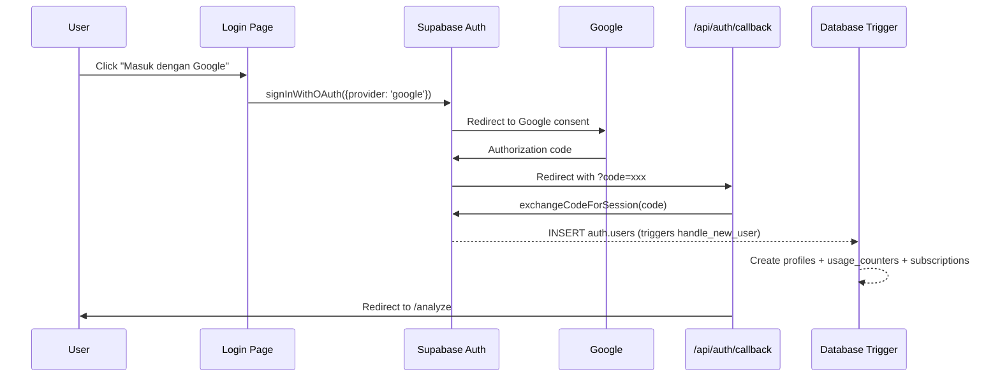
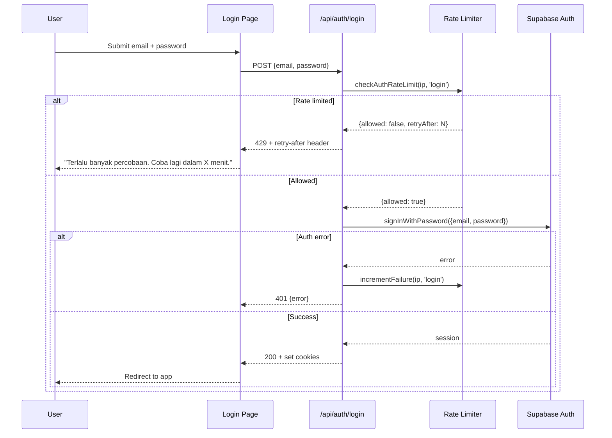

# Design Document: Supabase Auth Complete

## Overview

This design extends the existing StoryForge authentication system to add Google OAuth, password recovery, email verification enforcement, brute-force protection, account deletion (UU PDP compliance), and global logout. All features integrate with the existing `@supabase/ssr` v0.10.0 infrastructure, reusing the established patterns in `lib/supabase/`, `lib/auth/`, and the `(auth)` route group.

### Design Principles

1. **Extend, don't replace** — New features plug into existing middleware, callback route, and client/server helpers
2. **Server-side security** — Rate limiting and account deletion use server-side API routes with service role client
3. **Consistent UX** — All new pages follow the existing card-centered layout with Bahasa Indonesia copy
4. **Supabase-native** — Leverage Supabase Auth APIs (OAuth, password reset, admin) rather than custom implementations

## Architecture

```mermaid
graph TD
    subgraph "Client (Browser)"
        LP[Login Page]
        SP[Signup Page]
        FP[Forgot Password Page]
        UP[Update Password Page]
        VP[Verification Pending Page]
        SET[Settings Page]
    end

    subgraph "Middleware Layer"
        MW[middleware.ts]
        US[updateSession]
        VG[Verification Guard]
    end

    subgraph "API Routes (Server)"
        CB[/api/auth/callback]
        LR[/api/auth/login]
        RR[/api/auth/reset-password]
        DA[/api/auth/delete-account]
        GL[/api/auth/logout-all]
    end

    subgraph "Rate Limiter"
        RL[auth-rate-limit.ts]
    end

    subgraph "Supabase"
        SA[Supabase Auth]
        DB[(Database)]
        ADMIN[Admin API]
    end

    LP -->|Google OAuth| SA
    LP -->|Email/Password| LR
    SP -->|Google OAuth| SA
    SA -->|callback| CB
    FP -->|reset request| RR
    UP -->|updateUser| SA
    VP -->|resend| SA

    LR --> RL
    RR --> RL
    LR --> SA
    RR --> SA

    MW --> US
    US --> VG
    VG -->|unverified| VP

    SET -->|delete| DA
    SET -->|logout all| GL
    DA --> ADMIN
    DA --> DB
    GL --> ADMIN
```

### Request Flow: Google OAuth



### Request Flow: Brute-Force Protected Login



## Components and Interfaces

### New Files

| File | Purpose |
|------|---------|
| `lib/auth/rate-limit.ts` | In-memory sliding window rate limiter for auth endpoints |
| `app/api/auth/login/route.ts` | Server-side login proxy with rate limiting |
| `app/api/auth/reset-password/route.ts` | Server-side password reset request with rate limiting |
| `app/api/auth/delete-account/route.ts` | Account deletion with cascading deletes |
| `app/api/auth/logout-all/route.ts` | Global session invalidation |
| `app/(auth)/forgot-password/page.tsx` | Password reset request form |
| `app/(auth)/update-password/page.tsx` | New password entry form (after reset link click) |
| `app/(auth)/verify-email/page.tsx` | Verification pending page with resend button |

### Modified Files

| File | Changes |
|------|---------|
| `app/(auth)/login/page.tsx` | Add Google OAuth button, "Lupa password?" link, switch to server-side login proxy |
| `app/(auth)/signup/page.tsx` | Add Google OAuth button |
| `app/api/auth/callback/route.ts` | Handle OAuth provider detection, skip set-password for OAuth users, handle `type=recovery` for password reset |
| `lib/supabase/middleware.ts` | Add email verification guard logic |
| `middleware.ts` | Update matcher to include verify-email page exclusion |

### Interface: Rate Limiter (`lib/auth/rate-limit.ts`)

```typescript
interface RateLimitResult {
  allowed: boolean
  remaining: number
  retryAfterSeconds: number | null
}

type RateLimitAction = 'login' | 'reset'

// Check if an IP is allowed to perform the action
function checkAuthRateLimit(ip: string, action: RateLimitAction): RateLimitResult

// Increment failure count after a failed auth attempt
function recordAuthFailure(ip: string, action: RateLimitAction): void

// Extract client IP from request headers (Vercel x-forwarded-for)
function getClientIp(request: Request): string
```

Configuration:
- `login`: 5 attempts per 15-minute sliding window
- `reset`: 3 attempts per 15-minute sliding window
- `MAX_ENTRIES`: 5000 (prune threshold, matching existing pattern)

### Interface: Login Proxy (`app/api/auth/login/route.ts`)

```typescript
// POST /api/auth/login
// Body: { email: string, password: string }
// Success: 200 with session cookies set
// Rate limited: 429 with retry-after header
// Auth error: 401 with { error: string }
```

### Interface: Password Reset Request (`app/api/auth/reset-password/route.ts`)

```typescript
// POST /api/auth/reset-password
// Body: { email: string }
// Always returns 200 (prevents enumeration)
// Rate limited: 429 with retry-after header
```

### Interface: Account Deletion (`app/api/auth/delete-account/route.ts`)

```typescript
// POST /api/auth/delete-account
// Body: { password: string, confirmPhrase: string }
// Requires authenticated session
// Success: 200 + clears session
// Failure: 500 with { error: string, step: string }
```

### Interface: Global Logout (`app/api/auth/logout-all/route.ts`)

```typescript
// POST /api/auth/logout-all
// Requires authenticated session
// Success: 200 + clears session
// Failure: 500 with { error: string }
// Timeout: 15 seconds via AbortController
```

### Interface: Middleware Verification Guard

```typescript
// Added to lib/supabase/middleware.ts updateSession function
// Logic: if user exists AND email_confirmed_at is null AND providers is ["email"]
//   → redirect to /verify-email
// OAuth users (providers includes non-"email" provider) bypass this check
```

## Data Models

### No New Database Tables Required

All features use existing tables. The account deletion service operates on these tables in order:

```
analyze_sessions    → DELETE WHERE user_id = ?
analysis_history    → DELETE WHERE user_id = ?
analysis_events     → DELETE WHERE user_id = ?
projects            → DELETE WHERE user_id = ?
company_context     → DELETE WHERE user_id = ?
saved_clarifications → DELETE WHERE user_id = ?
usage_counters      → DELETE WHERE user_id = ?
subscriptions       → DELETE WHERE user_id = ?
profiles            → DELETE WHERE id = ?
auth.users          → admin.deleteUser(uid)
```

### In-Memory Data Structures

**Rate Limiter Buckets** (per action type):

```typescript
interface SlidingWindowEntry {
  timestamps: number[]  // timestamps of failed attempts within window
}

// Two separate Maps for login and reset
const loginBuckets = new Map<string, SlidingWindowEntry>()
const resetBuckets = new Map<string, SlidingWindowEntry>()
```

The sliding window approach stores individual attempt timestamps rather than a simple counter, allowing precise window expiration (each attempt expires independently after 15 minutes).

### Supabase Auth Metadata Used

| Field | Source | Usage |
|-------|--------|-------|
| `user.email_confirmed_at` | `auth.users` | Verification guard check |
| `user.app_metadata.providers` | `auth.users` | OAuth bypass detection |
| `user.user_metadata.full_name` | Google OAuth profile | Display name extraction |
| `user.user_metadata.name` | Google OAuth profile | Fallback display name |

### Environment Variables (No New Ones)

All features use existing env vars:
- `NEXT_PUBLIC_SUPABASE_URL`
- `NEXT_PUBLIC_SUPABASE_ANON_KEY`
- `SUPABASE_SERVICE_ROLE_KEY`

Google OAuth is configured in the Supabase Dashboard (not in app code).

## Correctness Properties

*A property is a characteristic or behavior that should hold true across all valid executions of a system — essentially, a formal statement about what the system should do. Properties serve as the bridge between human-readable specifications and machine-verifiable correctness guarantees.*

### Property 1: Verification guard routing correctness

*For any* user object with any combination of `email_confirmed_at` (null or timestamp) and `app_metadata.providers` (containing "email" only, or including an OAuth provider), and for any protected route path, the middleware verification guard SHALL:
- Allow access if `email_confirmed_at` is non-null
- Allow access if `providers` contains any provider other than "email" (OAuth bypass)
- Redirect to `/verify-email` only when `email_confirmed_at` is null AND `providers` is exactly `["email"]`

**Validates: Requirements 3.1, 3.6, 3.7**

### Property 2: Rate limiter sliding window enforcement

*For any* sequence of authentication attempts (login or reset) from a given IP address, with timestamps distributed across a 15-minute window, the rate limiter SHALL:
- Allow attempts when the count of attempts within the trailing 15-minute window is below the threshold (5 for login, 3 for reset)
- Reject attempts with correct `retryAfterSeconds` when the threshold is reached
- Allow new attempts once prior attempts have aged beyond the 15-minute window

**Validates: Requirements 4.1, 4.2, 4.6**

### Property 3: Display name extraction always produces a non-empty string

*For any* Google OAuth user metadata object (which may or may not contain `full_name`, `name`, or `email` fields), the display name extraction logic SHALL always produce a non-empty string — using `full_name` if present, falling back to `name`, falling back to the email prefix (portion before @).

**Validates: Requirements 1.4, 1.5**

### Property 4: Account deletion completeness

*For any* valid user ID that has associated records across all application tables, when the deletion service executes successfully, there SHALL be zero remaining rows for that user ID in analyze_sessions, analysis_history, analysis_events, projects, company_context, saved_clarifications, usage_counters, subscriptions, and profiles.

**Validates: Requirements 5.4**

### Property 5: Account deletion atomicity (rollback on failure)

*For any* point of failure during the cascading deletion sequence, if any single table deletion fails, the deletion service SHALL roll back all previously completed deletions such that the total row count for the user across all tables is identical to the state before deletion was attempted.

**Validates: Requirements 5.7**

### Property 6: Confirmation phrase validation strictness

*For any* string input to the account deletion confirmation check, the check SHALL return true if and only if the input is exactly "HAPUS AKUN" (case-sensitive, no leading/trailing whitespace). All other strings SHALL be rejected.

**Validates: Requirements 5.3**

## Error Handling

### Google OAuth Errors

| Scenario | Handling |
|----------|----------|
| User cancels consent screen | Supabase redirects to callback without `code` param → redirect to `/login?error=auth` |
| Google returns error | Same as above — callback route checks for `code`, redirects to login with error on absence |
| Code exchange fails | `exchangeCodeForSession` returns error → redirect to `/login?error=auth` |

The login page reads the `?error=auth` query param and displays: "Login dengan Google gagal. Silakan coba lagi."

### Password Reset Errors

| Scenario | Handling |
|----------|----------|
| Email not in system | Same 200 response as valid email (prevents enumeration) |
| Rate limited | 429 response with `retry-after` header; UI shows minutes remaining |
| Expired/invalid reset token | Update-password page detects missing session, shows error + link to request new reset |
| Password validation fails | Inline error messages, form fields preserved |

### Rate Limiter Errors

| Scenario | Handling |
|----------|----------|
| IP exceeds login threshold | 429 + `Retry-After` header + JSON `{ error: string, retryAfter: number }` |
| IP exceeds reset threshold | Same pattern with reset-specific threshold |
| Missing x-forwarded-for | Falls back to "unknown" IP (conservative — all unknown IPs share a bucket) |

### Account Deletion Errors

| Scenario | Handling |
|----------|----------|
| Re-authentication fails | 401 response, user stays on settings page |
| Confirmation phrase wrong | 400 response, user can retry |
| Table deletion fails | Roll back all completed deletes, return 500 with `{ error, step }` |
| Timeout (>30s) | Abort via AbortController/timeout, roll back, return 504 |
| Admin deleteUser fails | Roll back table deletions, return 500 |

### Global Logout Errors

| Scenario | Handling |
|----------|----------|
| Admin API call fails | 500 response, session preserved, error message shown |
| Timeout (>15s) | AbortController timeout, 504 response, session preserved |

## Testing Strategy

### Property-Based Tests (fast-check + vitest)

The project already has `fast-check` ^4.8.0 and `vitest` ^4.1.4 configured. Property tests will use these existing tools.

**Configuration:**
- Minimum 100 iterations per property test
- Each test tagged with: `Feature: supabase-auth-complete, Property N: {title}`

**Property tests to implement:**

1. **Verification guard routing** — Generate random user objects with varying `email_confirmed_at` and `providers`, verify routing decision
2. **Rate limiter sliding window** — Generate random attempt sequences with timestamps, verify allow/reject decisions
3. **Display name extraction** — Generate random user_metadata objects, verify non-empty string output
4. **Deletion completeness** — Generate random user data across tables, verify all cleaned after deletion (with mocked DB)
5. **Deletion atomicity** — Generate random failure points, verify rollback restores state (with mocked DB)
6. **Confirmation phrase strictness** — Generate random strings, verify only exact "HAPUS AKUN" passes

### Unit Tests (vitest)

- `validatePassword` edge cases (existing function, extend coverage)
- `sanitizeAuthRedirectPath` with OAuth redirect scenarios
- `getClientIp` with various header formats
- Login proxy route: success, auth error, rate limited responses
- Reset password route: always-200 behavior, rate limited
- Update password page: validation errors, success redirect
- Account deletion route: re-auth failure, wrong phrase, success flow
- Global logout route: success, timeout, error scenarios

### Integration Tests

- OAuth callback route: code exchange, new user detection, OAuth user skips set-password
- Middleware: verified user passes, unverified email user redirected, OAuth user bypasses
- Account deletion: full cascade with test database (if available)

### Manual Testing Checklist

- Google OAuth end-to-end (requires real Google credentials in Supabase dashboard)
- Password reset email delivery (requires configured email provider)
- Email verification flow with real email
- Rate limiting under concurrent requests on Vercel (approximate due to serverless)

