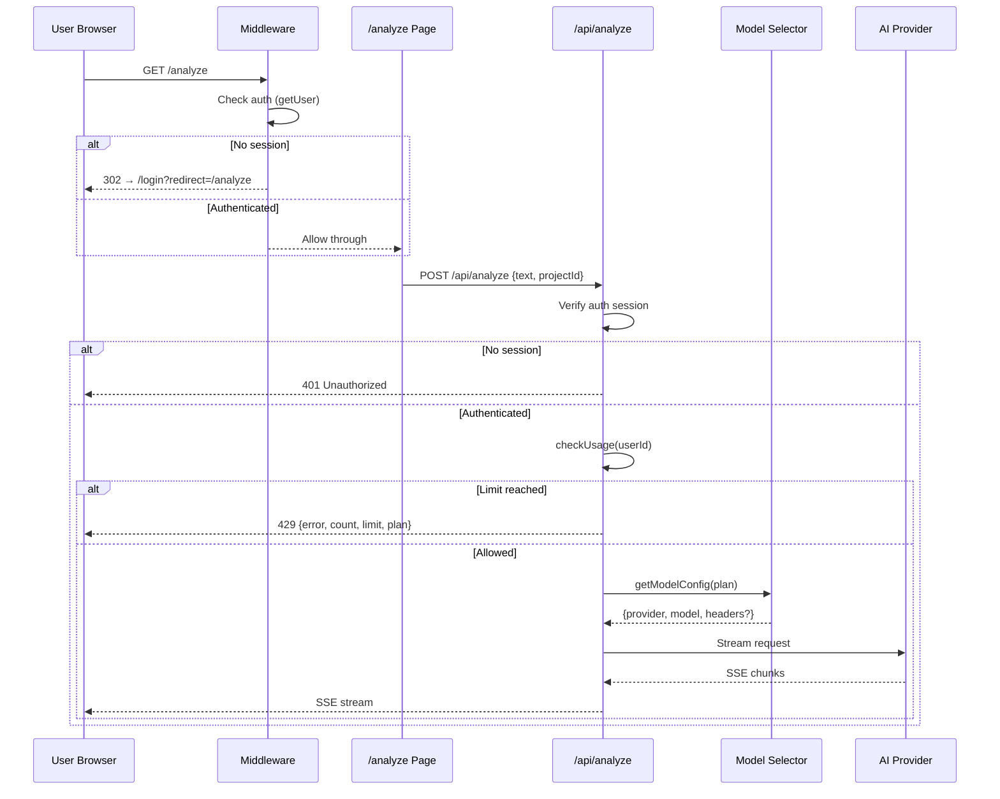

# Design Document: v2-core-ux

## Overview

This design covers the core UX changes for StoryForge v2.0 Sprint 1: removing guest mode, implementing tiered AI model selection, restructuring the analyze page for Free vs Pro users, adding usage counters, tier badges, watermarks, and upgrade CTAs.

The changes span five layers:
1. **Middleware** — Extend route protection to cover `/analyze` exactly (not just `/analyze/`)
2. **API routes** — Remove guest-mode fallback, enforce auth, integrate model selector
3. **Model selector** — New module that returns the correct AI client/model based on user plan
4. **Analyze page** — Conditional UX (Free: direct BRD input; Pro: project selector + context)
5. **UI components** — Usage counter, tier badge, watermark renderer, upgrade CTA

### Design Decisions

| Decision | Choice | Rationale |
|----------|--------|-----------|
| Model selector as pure function | `getModelConfig(plan)` returns config object | Keeps it testable, no DB dependency, easy to extend for future "team" tier |
| Gemini via Vercel AI SDK | Use `@ai-sdk/google` already installed | Avoids adding another SDK; consistent streaming interface |
| Watermark as client-side renderer | Append in React component, not in API response | Keeps API output clean; watermark is a presentation concern |
| Usage counter fetched server-side | Server component or API call on page load | Prevents client-side tampering; single source of truth |
| Upgrade CTA inline (not blocking wall) | Show CTA within the page flow, blocking wall only after 2x limit (6 analyses) | PRD says "no blocking wall" for soft limit; hard block at 2x prevents abuse |
| Tier badge in global header | Display badge in app header across all pages | Consistent tier awareness regardless of current page |
| Auth error fallback | Show error state when login services unavailable | Prevents blank page when OAuth/email services are down |

## Architecture

```mermaid
graph TD
    subgraph Client
        A[Analyze Page] --> B[BRDInput]
        A --> C[ProjectSelector - Pro only]
        A --> D[UsageCounter]
        A --> E[TierBadge]
        A --> F[WatermarkRenderer]
        A --> G[UpgradeCTA]
    end

    subgraph Middleware
        H[updateSession] --> I{isProtectedAppPath}
        I -->|/analyze| J[Redirect to /login]
    end

    subgraph API Layer
        K[/api/analyze] --> L[Auth Guard]
        L --> M[Model Selector]
        M -->|free| N[Gemini 2.0 Flash]
        M -->|pro| O[Anthropic Claude Haiku 4.5 + ZDR]
        K --> P[Usage Check]
    end

    subgraph Data
        Q[subscriptions table]
        R[usage_counters table]
    end

    P --> Q
    P --> R
    D -->|fetch| R
```

### Request Flow (Post-Refactor)



## Components and Interfaces

### 1. Model Selector (`lib/model-selector.ts`)

```typescript
export type AIProvider = 'google' | 'anthropic'

export interface ModelConfig {
  provider: AIProvider
  model: string
  /** Additional headers (e.g., ZDR for Anthropic) */
  headers?: Record<string, string>
}

/**
 * Returns the AI model configuration based on user's subscription plan.
 * Pure function — no database access.
 */
export function getModelConfig(plan: 'free' | 'pro'): ModelConfig
```

**Behavior:**
- `plan === 'free'` → `{ provider: 'google', model: 'gemini-2.0-flash', headers: undefined }`
- `plan === 'pro'` → `{ provider: 'anthropic', model: 'claude-haiku-4-5-20251001', headers: { 'anthropic-beta': 'zdr-2025-01-01' } }`

### 2. Middleware Update (`lib/supabase/middleware.ts`)

Update `isProtectedAppPath` to also match `/analyze` exactly:

```typescript
export function isProtectedAppPath(pathname: string): boolean {
  return (
    pathname === '/analyze' ||
    pathname.startsWith('/analyze/') ||
    pathname.startsWith('/dashboard') ||
    pathname.startsWith('/settings') ||
    pathname.startsWith('/set-password')
  )
}
```

### 3. API Route Auth Guard (shared pattern)

Each API route (`/api/analyze`, `/api/refine`, `/api/requirements`) will:
1. Create Supabase server client
2. Call `getUser()`
3. If no user → return `NextResponse.json({ error: 'Unauthorized' }, { status: 401 })`
4. Remove all `x-guest-mode` header handling

### 4. Usage Counter Component (`components/analyze/UsageCounter.tsx`)

```typescript
interface UsageCounterProps {
  used: number
  limit: number
  plan: 'free' | 'pro'
  onClick?: () => void
}

export function UsageCounter({ used, limit, plan, onClick }: UsageCounterProps): JSX.Element
```

**Color logic:**
- `limit === 0` → hide counter or display distinct "N/A" state (special case to avoid division by zero)
- `remaining > 50%` → green (`text-green-600`)
- `25% <= remaining <= 50%` → yellow (`text-yellow-600`)
- `remaining < 25%` → red (`text-red-600`)

Where `remaining = (limit - used) / limit` (only calculated when `limit > 0`).

### 5. Tier Badge Component (`components/ui/TierBadge.tsx`)

```typescript
interface TierBadgeProps {
  plan: 'free' | 'pro'
}

export function TierBadge({ plan }: TierBadgeProps): JSX.Element
```

Renders a small pill badge: "Free" (gray bg) or "Pro" (teal bg). Placed in the global app header (not page-specific) so it appears on all authenticated pages.

### 6. Watermark Renderer (`components/analyze/Watermark.tsx`)

```typescript
interface WatermarkProps {
  plan: 'free' | 'pro'
}

export function Watermark({ plan }: WatermarkProps): JSX.Element | null
```

- If `plan === 'free'`: renders the watermark text with reduced opacity
- If `plan === 'pro'`: returns `null`

Watermark text: `"Generated by StoryForge.id — Upgrade ke Pro untuk menghapus watermark"`

### 7. Upgrade CTA Component (`components/analyze/UpgradeCTA.tsx`)

```typescript
interface UpgradeCTAProps {
  message?: string
}

export function UpgradeCTA({ message }: UpgradeCTAProps): JSX.Element
```

Displays an inline card with upgrade messaging and a link to the pricing/upgrade page.

### 8. Usage Data Fetching

Server-side fetch on page load using the existing `getUsageForUser()` function. The analyze page will call a lightweight API endpoint or use a React Server Component to pass initial usage data as props.

```typescript
// app/api/usage/route.ts (new)
export async function GET(request: NextRequest): Promise<NextResponse> {
  // Auth check first — if no session, skip fetch and return fallback
  // If authenticated → getUsageForUser → return { count, limit, plan }
}
```

**Authentication-aware fetching:** The client-side code checks for an authenticated session before calling `/api/usage`. If no session exists (e.g., during SSR hydration race), the component renders the fallback state directly without making the network request.

### 9. Auth Error Fallback (`components/AuthErrorFallback.tsx`)

```typescript
interface AuthErrorFallbackProps {
  message?: string
}

export function AuthErrorFallback({ message }: AuthErrorFallbackProps): JSX.Element
```

Displayed on login/signup pages when both Google OAuth and email/password services are unavailable. Shows a user-friendly error message with a retry option.

### 10. Blocking Wall for Excessive Usage (`components/analyze/BlockingWall.tsx`)

```typescript
interface BlockingWallProps {
  used: number
  limit: number
}

export function BlockingWall({ used, limit }: BlockingWallProps): JSX.Element
```

Displayed when a free-tier user exceeds 2x their monthly limit (more than 6 analyses). Full-screen overlay preventing further analysis until upgrade. Below 2x limit, only the inline Upgrade CTA is shown.

## Data Models

### Existing Tables (No Schema Changes)

| Table | Key Columns | Usage in This Feature |
|-------|-------------|----------------------|
| `subscriptions` | `user_id`, `plan` ('free'\|'pro') | Determine tier for model selection, badge, watermark |
| `usage_counters` | `user_id`, `count`, `reset_at`, `first_analysis_at` | Usage counter display, limit enforcement |
| `analysis_events` | `user_id`, `session_id`, `event_type`, `word_count`, `duration_ms` | Logging (unchanged) |

### Model Selector Input/Output

```typescript
// Input: plan string from subscriptions table
type Plan = 'free' | 'pro'

// Output: configuration for AI call
interface ModelConfig {
  provider: 'google' | 'anthropic'
  model: string
  headers?: Record<string, string>
}
```

### Usage Counter Response Shape

```typescript
interface UsageResponse {
  count: number   // analyses used this period
  limit: number   // tier cap (3 for free, 50 for pro)
  plan: 'free' | 'pro'
}
```

### Files to Delete (Guest Mode Removal)

| File | Reason |
|------|--------|
| `lib/guest-usage.ts` | localStorage-based guest tracking |
| `lib/guest-rate-limit.ts` | IP-based rate limiting for guests |
| `lib/session/temp-session.ts` | Temporary session management |
| `lib/session/use-migrate-temp-session.ts` | Session migration hook |
| `app/api/migrate-session/route.ts` | Migration API endpoint |


## Correctness Properties

*A property is a characteristic or behavior that should hold true across all valid executions of a system — essentially, a formal statement about what the system should do. Properties serve as the bridge between human-readable specifications and machine-verifiable correctness guarantees.*

### Property 1: Protected path coverage

*For any* URL path that equals `/analyze` or starts with `/analyze/`, the `isProtectedAppPath` function SHALL return `true`.

**Validates: Requirements 1.2, 1.3**

### Property 2: ZDR header invariant for Anthropic models

*For any* plan value where `getModelConfig(plan)` returns `provider: 'anthropic'`, the returned config SHALL include the header `anthropic-beta: zdr-2025-01-01`.

**Validates: Requirements 5.3**

### Property 3: Usage counter display format

*For any* valid `(used, limit)` pair where `0 <= used <= limit` and `limit > 0`, the Usage Counter component SHALL render text matching the pattern `"{used}/{limit} analisis"`.

**Validates: Requirements 10.1**

### Property 4: Usage counter color matches threshold band

*For any* valid `(used, limit)` pair where `0 <= used <= limit` and `limit > 0`, the usage counter color SHALL be:
- Green when `(limit - used) / limit > 0.5`
- Yellow when `0.25 <= (limit - used) / limit <= 0.5`
- Red when `(limit - used) / limit < 0.25`

**Validates: Requirements 10.2, 10.3, 10.4**

### Property 5: Zero-limit counter special case

*For any* `(used, limit)` pair where `limit === 0`, the Usage Counter component SHALL NOT attempt percentage calculation and SHALL render a distinct fallback state.

**Validates: Requirements 10.5**

### Property 6: Watermark all-or-nothing

*For any* analysis result displayed to a free-tier user, ALL output sections (gap list, clarification questions, PRD) SHALL have watermarks rendered simultaneously — partial watermarking SHALL NOT occur.

**Validates: Requirements 11.4**

## Error Handling

### Middleware Errors

| Scenario | Behavior |
|----------|----------|
| Supabase auth service unavailable | Let request through (fail-open for middleware); API routes will catch at their own auth check |
| Malformed cookies | Supabase SSR handles gracefully; user treated as unauthenticated |

### API Route Errors

| Scenario | HTTP Status | Response |
|----------|-------------|----------|
| No auth session | 401 | `{ error: "Unauthorized", message: "Login diperlukan." }` |
| Usage limit reached | 429 | `{ error: "Limit reached", count, limit, plan }` |
| Invalid/missing request body | 400 | `{ error: "Missing text" }` |
| BRD text too large | 413 | `{ error: "BRD text too large" }` |
| AI provider error (Gemini/Anthropic) | SSE error event | `{ error: "Terjadi kesalahan. Coba lagi." }` |
| AI returns empty response | SSE error event | `{ error: "AI returned empty response. Coba lagi." }` |
| JSON parse failure on AI output | SSE error event | `{ error: "Terjadi kesalahan. Coba lagi." }` |

### Usage Counter Errors

| Scenario | Behavior |
|----------|----------|
| `/api/usage` fetch fails | Display fallback state (e.g., "—/— analisis" in gray); do NOT block BRD input |
| Network timeout | Same fallback; user can still submit BRD (server will enforce limits at API level) |

### Model Selector Errors

The model selector is a pure function with a finite input domain (`'free' | 'pro'`). It cannot fail at runtime. If an unknown plan value is somehow passed, it defaults to the free tier config (defensive fallback).

## Testing Strategy

### Unit Tests (Vitest)

| Area | Tests |
|------|-------|
| `isProtectedAppPath` | Exact `/analyze`, `/analyze/`, `/analyze/123`, `/dashboard`, `/settings`, negative cases (`/login`, `/api/analyze`) |
| `getModelConfig` | Returns correct config for 'free' and 'pro'; ZDR header present for 'pro' |
| `UsageCounter` | Renders correct format, correct color classes for each threshold band |
| `TierBadge` | Renders "Free" or "Pro" with correct styling |
| `Watermark` | Renders for free, returns null for pro |
| `UpgradeCTA` | Renders with message, contains upgrade link |
| API routes (mocked) | 401 for unauthenticated, correct model used per plan |

### Property-Based Tests (fast-check + Vitest)

| Property | Generator | Iterations |
|----------|-----------|------------|
| Property 1: Path coverage | Random strings appended to `/analyze` | 100+ |
| Property 2: ZDR invariant | All plan values that map to anthropic | 100+ |
| Property 3: Counter format | Random `(used, limit)` pairs, `0 <= used <= limit`, `limit ∈ [1, 1000]` | 100+ |
| Property 4: Counter color | Random `(used, limit)` pairs across all threshold bands | 100+ |

**Configuration:**
- Library: `fast-check` (already in devDependencies)
- Runner: `vitest` (already configured)
- Each property test tagged with: `Feature: v2-core-ux, Property {N}: {title}`
- Minimum 100 iterations per property

### Integration Tests

| Test | Scope |
|------|-------|
| Middleware redirect | Full middleware function with mock Supabase client |
| API analyze route | End-to-end with mocked AI provider, verify auth + model selection |
| Page load usage fetch | Verify server-side data fetching on analyze page |

### Smoke Tests

| Test | Scope |
|------|-------|
| Guest files deleted | Verify `lib/guest-usage.ts`, `lib/guest-rate-limit.ts`, `lib/session/temp-session.ts`, `lib/session/use-migrate-temp-session.ts`, `app/api/migrate-session/` do not exist |
| No banned imports | Grep for `canGuestAnalyze`, `incrementGuestUsage`, `readGuestUsage`, `checkGuestRateLimit`, `useMigrateTempSession`, `x-guest-mode` |
| Build passes | `next build` completes without errors after all removals |
